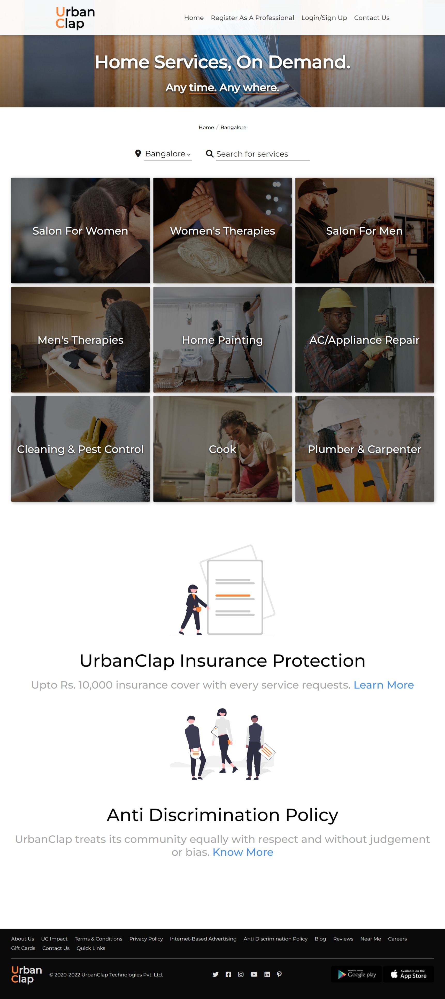
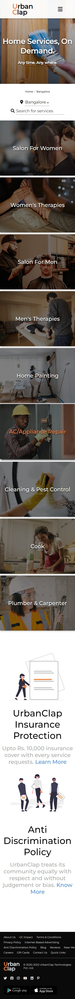
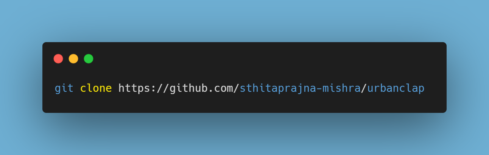

# UrbanClap: Home Service Website

<a href="https://urbanclap.netlify.app">View Demo</a>

## About the project

This project is focused on creating a minimalistic but attractive website for connecting customers with home service professionals. Based on the popular platform [UrbanCompany](https://www.urbancompany.com/bangalore) (erstwhile UrbanClap), this project is mostly focused on the design and responsiveness of the website. Though no backend work is present at the moment, this can easily serve as a front-end template for a full-stack project.

Attached below are a few screenshots of this site - 

### **1. Laptop View**
 

### **2. Phone View**
 

## Built With

+ HTML
+ CSS
+ JavaScript

## Tools

+ [git](https://git-scm.com/downloads)
+ [Visual Studio Code](https://code.visualstudio.com/)
+ [Live Server](https://marketplace.visualstudio.com/items?itemName=ritwickdey.LiveServer)

## Setup and Installation

+ In order to set up all the code on your local machine, you can either download a ZIP of all the files directly or you can clone the code to your local machine, provided you installed git.

+ Run the following git command on your command line terminal to clone the files to your machine - 

+ Once the files are on your machine, open the medium-clone folder in Visual Studio Code.

+ With the files open in Visual Studio Code, press the Go Live button at the bottom of the window to launch the files with Live Server.
